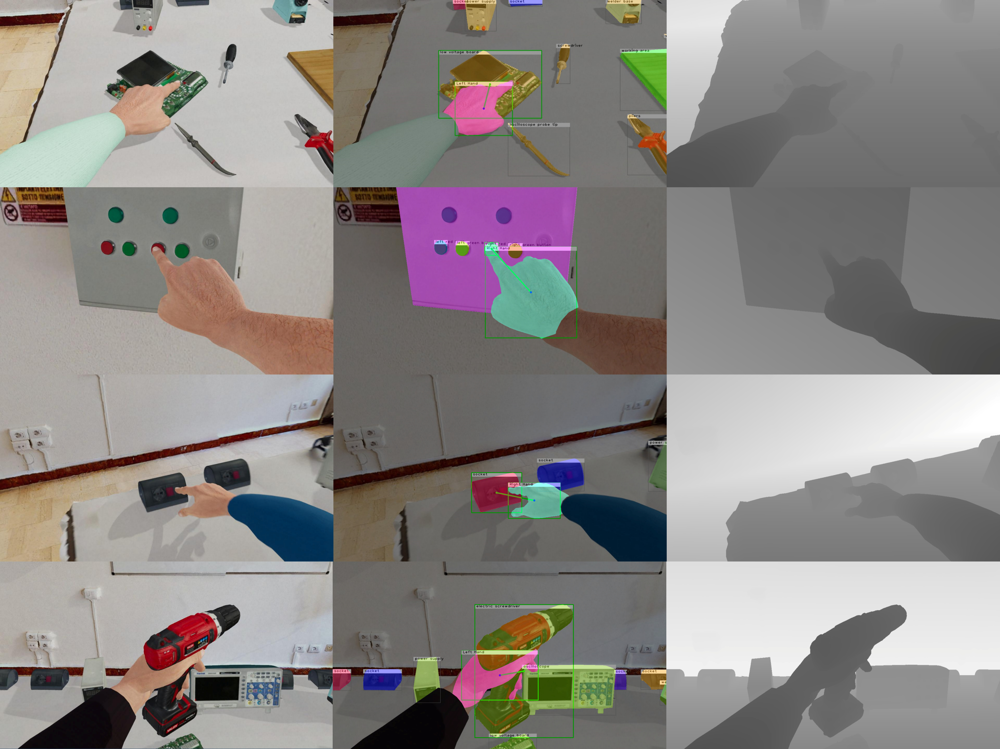

# Exploiting Multimodal Synthetic Data for Egocentric Human-Object Interaction Detection in an Industrial Scenario


This repository contains the implementation of the following paper:
* [Exploiting Multimodal Synthetic Data for Egocentric Human-Object Interaction Detection in an Industrial Scenario](https://arxiv.org/abs/2306.12152)

If you find the code, pre-trained models, or the *EgoISM-HOI* dataset useful for your research, please citing the following paper:
```
@article{leonardi2023exploiting,
  title={Exploiting Multimodal Synthetic Data for Egocentric Human-Object Interaction Detection in an Industrial Scenario},
  author={Leonardi, Rosario and Ragusa, Francesco and Furnari, Antonino and Farinella, Giovanni Maria},
  journal={arXiv preprint arXiv:2306.12152},
  year={2023}
}
```

Additionally, consider citing the original paper:
* [Egocentric Human-Object Interaction Detection Exploiting Synthetic Data](https://arxiv.org/abs/2204.07061)
```
@inproceedings{leonardi2022egocentric,
  title={Egocentric Human-Object Interaction Detection Exploiting Synthetic Data},
  author={Leonardi, Rosario and Ragusa, Francesco and Furnari, Antonino and Farinella, Giovanni Maria},
  booktitle={Image Analysis and Processing -- ICIAP 2022},
  pages={237--248},
  year={2022},
}
```
Additional details can be found on our [project web page](http://iplab.dmi.unict.it/egoism-hoi).

## Installation
### Prerequisites
* Python==3.9
* Pytorch>=1.9.0

Create a new conda env:
```
conda create --name ego_hoi python=3.9
conda activate ego_hoi
```

Install all the python dependencies using pip:
```
pip install -r requirements.txt
```

## EgoISM-HOI dataset
*EgoISM-HOI* (Egocentric Industrial Synthetic Multimodal dataset for Human-Object Interaction detection) is a new photo-realistic dataset of EHOIs in an industrial scenario with rich 
annotations of hands, objects, and active objects, including class labels, depth maps, and instance segmentation masks. Download the [*EgoISM-HOI*](https://iplab.dmi.unict.it/sharing/egoism-hoi/datasets/egoism-hoi-dataset.zip) dataset and place it in the `data` folder.



## Model Zoo
Download our pre-trained models and put them in the `weights` folder:

| id                                                                                        | contact state predictions |  mhs input modalities           | mAP Hand+ALL  |
| :----------------                                                                         | :-----------------------: | :-----------------------------: | :-----------: |
| [fancy-sun-301](https://iplab.dmi.unict.it/sharing/egoism-hoi/weights/fancy-sun-301.zip)  | HS (Base)                 |  -                              | 35.47         |
| [383_31_lf](https://iplab.dmi.unict.it/sharing/egoism-hoi/weights/383__31_lf.zip)         | HS+MHS (Late Fusion)      |  RGB                            | 35.71         |
| [383_37_lf](https://iplab.dmi.unict.it/sharing/egoism-hoi/weights/383__37_lf.zip)         | HS+MHS (Late Fusion)      |  RGB+DEPTH (Early Fusion)       | 35.92         |
| [383_80_lf](https://iplab.dmi.unict.it/sharing/egoism-hoi/weights/383__80_lf.zip)         | HS+MHS (Late Fusion)      |  RGB+MASK (Early Fusion)        | 35.34         |
| [383_33_lf](https://iplab.dmi.unict.it/sharing/egoism-hoi/weights/383__33_lf.zip)         | HS+MHS (Late Fusion)      |  RGB+DEPTH+MASK (Early Fusion)  | **36.51**     |
| [383_33](https://iplab.dmi.unict.it/sharing/egoism-hoi/weights/383__33.zip)               | MHS                       |  RGB+DEPTH+MASK (Early Fusion)  | 35.81         |

To replicate the results of the paper, train your model using these pre-trained [weights](https://iplab.dmi.unict.it/sharing/egoism-hoi/weights/faster_rcnn_R_101_FPN_3x_midas_v21-f6b98070.pth). Additional details are reported in the paper.

## Proposed Approach


### Train
To train the system enter the following command:
```
python train.py --train_json ./data/egoism-hoi-dataset/annotations/train_coco.json --test_json ./data/egoism-hoi-dataset/annotations/val_coco.json --test_dataset_names val --weights_path /home/rleonardi/data/weights/ehoi_detectron2/faster_rcnn_R_101_FPN_3x_midas_v21-f6b98070.pth --mask_gt
```
Check more about argparse parameters in `train.py`.

### Test
To test the models run the command below:
```
python test.py --dataset_json ./data/egoism-hoi-dataset/annotations/r_test_coco.json --dataset_images ./data/egoism-hoi-dataset/images/ --weights_path ./weights/383__33_lf/model_final.pth 
```
Check more about argparse parameters in `test.py`.

### Inference
Run the command below for an example of inference. A new folder **output_detection** will be created with the visualization:
```
python inference.py --weights_path <weights_path> --images_path <images_path>
```
Check more about argparse parameters in `inference.py`.

## Ackowledgements
This research is supported by [Next Vision](https://www.nextvisionlab.it/) s.r.l., by MISE - PON I\&C 2014-2020 - Progetto ENIGMA  - Prog n. F/190050/02/X44 – CUP: B61B19000520008, and by the project Future Artificial Intelligence Research (FAIR) – PNRR MUR Cod. PE0000013 - CUP: E63C22001940006.
